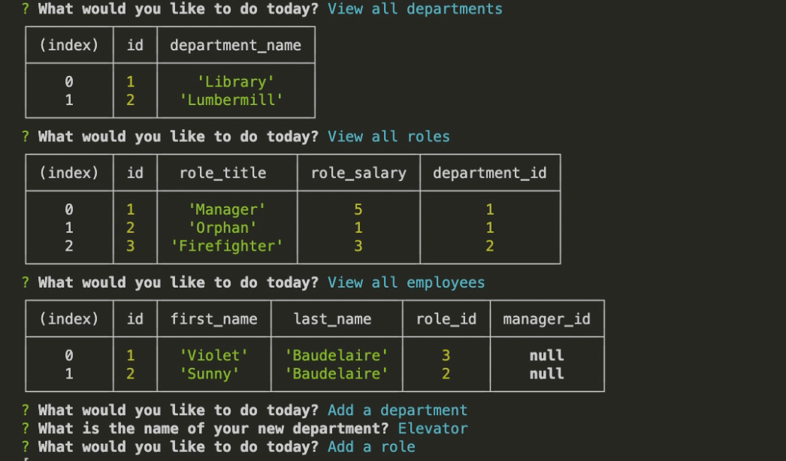

  # TEAM DATABASE 

  ## TABLE OF CONTENTS
  * [Description](#description)
  * [Installation](#installation)
  * [Usage](#usage)
  * [Tests](#tests)
  * [FAQ](#faq)

  ## DESCRIPTION
  Use Inquirer to access a SQL database and view, add, and update everything from deptartments and roles to employees in your company!
    App Walkthrough: https://drive.google.com/file/d/1OXEwXNRrQzu8fOjJpujsNiXXOngOnyf-/view?usp=sharing

  ## INSTALLATION
 Before running this application, make sure to install Inquirer, and Node.

  ## TESTS
No tests for this iteration of Team Datbase. Check again soon!

  ## USAGE
  To run the application, open a terminal in the same location as the project and run:
  
      node index.js
      
  
  

  ## FAQ
  * shadin.alarab@gmail.com
  * https://github.com/shadin-a
  * Feel free to reach me via my carrier pigeon, Hank.

  # LICENSE
  
  Licensed by https://opensource.org/licenses/MIT
